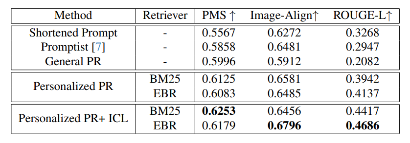

# TailoredVision
## Official implementation for "Tailored Visions: Enhancing Text-to-Image Generation with Personalized Prompt Rewriting"

[GitHub](https://github.com/zzjchen/TailoredVision) | [arXiv](https://arxiv.org/abs/2310.08129) | [PIP dataset](https://drive.google.com/file/d/14VGi9ZQVxn7IX4iRWqLPtT6dhcnH7mUw/view?usp=sharing)

This repository contains the code for implementing our method (Personalized PR) with the usage of our Personalized Image-Prompt (PIP) dataset. Manuscript of our paper is available on arXiv.

We aim to understand the intended desire of users from their historical interactions, which is achieved through the following process.

1) Retrieve top-k relevant prompt histories for current query;
2) Perform personalized prompt rewriting using ChatGPT;
3) Perform personalized T2I using Stable Diffusion v1-5.

### <mark>**!!! Note:**</mark>
Due to changes to our cloud storage. The image URL provided in our dataset is currently unavailable. We're trying to fix it by searching for backups.

Generally, our method uses only the user prompt as input, and the original image is only included in evaluation. This should not affect most part of our code.

If you intend to use the original image (such as calculating "Image-Align" score), an alternative approach would be to generate one (using the user prompt and a T2I model). This should roughly be ok. 

## Requirements
First, clone this repository:
```
git clone https://github.com/zzjchen/TailoredVision.git
cd TailoredVision
```
An environment for this project can be created by running:
```
conda create -n TV python=3.9
pip install -r requirements.txt
pip install git+https://github.com/openai/CLIP.git
```

## PIP Dataset
Here we introduce the usage of our PIP (Personalzed Image-Prompt) [dataset](https://drive.google.com/file/d/14VGi9ZQVxn7IX4iRWqLPtT6dhcnH7mUw/view?usp=sharing), which is a new personalized large-scale text-to-image dataset with over 300k prompts from 3115 users. The original user T2I histories are collected from a text-to-image website we hosted.

Download our PIP Dataset from the link before, which shares the same train-test split for each user and does not require further processing. Unzip it into 'user_data' directory for usage.
```
mkdir user_data
unzip PIP-dataset.zip -d user_data
```
The data for each user is included in a separate jsonline file, with the filename as his unique user ID. Each file includes the training samples as well as 2 test sample of the user. Values in each sample as well as their meanings are shown below.

| Value | Meaning |
| :---: | :--------------------|
| result_url | URL where the image can be downloaded |
| prompt | Prompt used to generate the image |
| resolution_power | Resolution of the image |
| NSFW | Indicator of potential NSFW. The results are calculated using many NSFW detectors including our private models and some publicly available models like ([this](https://huggingface.co/michellejieli/NSFW_text_classifier) and [this](https://huggingface.co/Falconsai/nsfw_image_detection)). "Unlikely" means the image and prompt are very unlikely to contain NSFW content. "NSFW" means that either the image or the prompt is likely to contain NSFW content. "Unsure" means that the detectors contradict each other to some extent, indicating potential NSFW contents. |
| proportion | Proportion of the image. |
| user_id | User ID|
| id | A unique ID assigned to each text-to-image generation on our website. | 


## Usage

Our method performs personalized text-to-image (T2I) generation by capturing user preferences from past T2I interactions. This is achieved through retrieving relevant history prompts, personalized prompt rewriting, and T2I using rewritten prompt.

We provide demos as well as scripts to run our method on PIP Dataset below. Our method uses ChatGPT and Stable Diffusion(v1-5), thus it requires:

1. **Accessibility to ChatGPT**: Please fill "MY_KEY", "MY_ORG" in apiuse.py with your OpenAI API Key and Organization. If you have special API BASE also modify "MY_BASE"
2. **GPU** with at least 12GB VRAM

### Demo
Here we provide a demo of our method using T2I history from one user in our PIP dataset. Try it out by running (modify GPU ID according to your environment, or remove the variable if you want to run on CPU):
```
CUDA_VISIBLE_DEVICES=0 python demo.py --input_prompt='a cat' --t2i
```
This will rewrite the input prompt according to a user's preference. 

To disable text-to-image generation, run:
```
CUDA_VISIBLE_DEVICES=0 python demo.py --input_prompt='a cat'
```

### Run on PIP Dataset
To experiment our method Personalized PR on PIP dataset, run main.py with the following command:
```
CUDA_VISIBLE_DEVICES=0 python main.py --retrieval=ebr --num_retrieval=3 --rewrite_method=ICL --ICL_shot=1 --t2i
```
The meaning as well as available values for each argument are shown below, the default values are shown **bold**.

| Name | Available Values | Meaning  |
| :----: | :--------------- | :------  |
| retrieval | **'ebr'**,'bm25' | Retriever Method: embedding based retrieval 'ebr' or sparse retrieval 'bm25'  |
| num_retrieval | 1,**3**,5,7 | Number of Retrieval Result |
| rewrite_method | **'naive'**, 'ICL' | Rewriting Method: context-independent rewriting 'naive' or in-contect rewriting 'ICL' |
| ICL_shot | 1,3,5 | Number of examples for in-context rewriting. Only useful when 'rewrite_method' is set to ICL |
| t2i | 'store_true' | Pass the argument '--t2i' to perform text-to-image generation. Or pass nothing to just perform prompt rewriting |


## Performance

### Evaluation metrics
The metrics used for this offline evaluation include: **PMS**, **Image-Align**, and **ROUGE-L** (see definitions referring to the [paper](https://arxiv.org/abs/2310.08129)). The result of offline evaluation are shown below.


### Examples
We showcase 3 examples of our method Personalized PR, with each row of figure x representing an example. For each example, "Shortened Prompt" is used as input prompt of our method, and "Personalized Prompt" represents the image generated using personalized prompt rewritten using Personalized PR.


## Citation

```
@misc{chen2023tailored,
      title={Tailored Visions: Enhancing Text-to-Image Generation with Personalized Prompt Rewriting}, 
      author={Zijie Chen and Lichao Zhang and Fangsheng Weng and Lili Pan and Zhenzhong Lan},
      year={2023},
      eprint={2310.08129},
      archivePrefix={arXiv},
      primaryClass={cs.CV}
}
```
